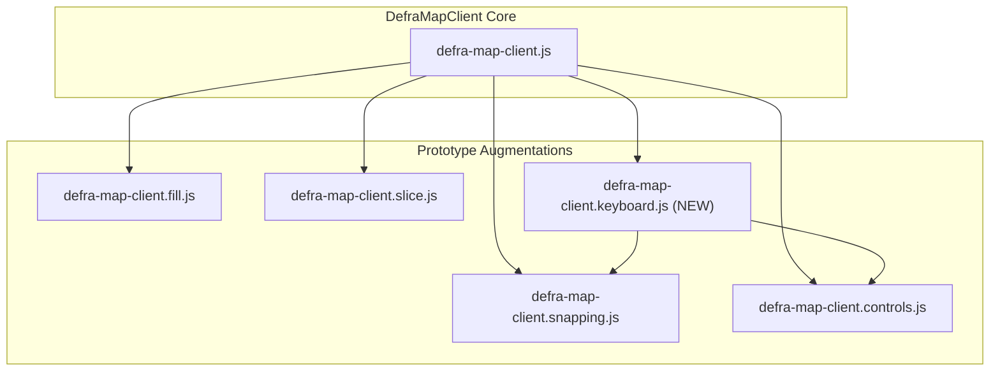

# Map Keyboard Accessibility

## Architecture

Create a new module `defra-map-client.keyboard.js` that follows the existing prototype augmentation pattern used by other modules (snapping, fill, slice, controls).



## Key Files to Modify/Create

### 1. New File: `app/assets/javascripts/defra-map-lib/defra-map-client.keyboard.js`

Keyboard interaction module implementing:

- **Map Focus Management**
  - Make map container focusable with `tabindex="0"`
  - Add ARIA attributes (`role="application"`, `aria-label`)
  - Focus outline styling

- **Navigation Keys** (when map is focused)
  - Arrow keys: Pan map (configurable step size based on zoom)
  - `+`/`=` and `-`: Zoom in/out
  - `Home`: Reset to initial view

- **Menu Toggle**
  - `Ctrl+M`: Open/close the drawing tools drawer
  - Work with existing controls module via event coordination

- **Keyboard Drawing Mode**
  - Show center target overlay when a draw tool is active
  - `Ctrl+Space`: Drop a point at the center (or snapped position)
  - Target icon remains fixed at center; map pans underneath
  - Yellow snap indicator shows actual drop position (snapped or unsnapped)
  - `Enter`: Complete/close polygon (same as clicking first vertex)
  - `Escape`: Cancel drawing

### 2. Modify: `app/views/layouts/map-layout.html`

- Add skip link component targeting the map container
- Override the `skipLink` block to include `govukSkipLink` with `href: "#map"`

```nunjucks

  {{ govukSkipLink({
    text: "Skip to map",
    href: "#map"
  }) }}

```

### 3. Modify: `app/assets/sass/application.scss`

Add styles for:

- Map container focus state (`:focus-visible` outline)
- Center target crosshair overlay
- Keyboard mode indicator
- Snap point indicator positioning

```scss
// Keyboard target crosshair
.defra-map-keyboard-target {
  position: absolute;
  top: 50%;
  left: 50%;
  transform: translate(-50%, -50%);
  pointer-events: none;
  z-index: 800;
}
```

### 4. Modify: `app/views/layouts/map-layout.html`

Add script include for the new keyboard module after `defra-map-client.controls.js`:

```html
<script src="/public/javascripts/defra-map-lib/defra-map-client.keyboard.js"></script>
```

## Implementation Details

### Center Target Icon

SVG crosshair icon rendered as a fixed overlay in the map container center. Shows when:

- Map is focused AND a drawing tool is active
- Hidden during mouse/pointer drawing

### Snap Indicator for Keyboard

Reuse existing `_hoverSource` and `_hoverFeature` for snap preview:

- Calculate snap point for map center coordinate
- Update hover marker position to show snapped location
- Yellow dot appears at snapped position (may differ from center target)

### Keyboard Event Handling

```javascript
DefraMapClient.prototype._setupKeyboardInteraction = function () {
  const target = this._map.getTargetElement()
  target.setAttribute('tabindex', '0')
  target.setAttribute('role', 'application')
  target.setAttribute('aria-label', 'Interactive map')

  target.addEventListener('keydown', (e) => this._handleMapKeydown(e))
  document.addEventListener('keydown', (e) => this._handleGlobalKeydown(e))
}
```

### Drawer Menu Keyboard Navigation

The existing controls module creates focusable buttons. Enhancements:

- Trap focus within drawer when open
- `Escape` closes drawer
- First button receives focus when drawer opens

## Skip Link for Map Pages

The GOV.UK Prototype Kit uses `govuk-prototype-kit/layouts/govuk-branded.njk` which includes a skip link block. Override it in `map-layout.html`:

```nunjucks

  {{ govukSkipLink({
    text: "Skip to map",
    href: "#map"
  }) }}

```

The `#map` ID already exists on the map container div in `map-layout.html`.
